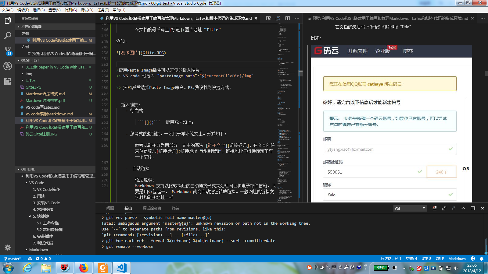

利用VS Code和Git搭建用于编写和管理Markdown、LaTex和脚本代码的集成环境
---

[TOC]

## VS Code

### 1. VS Code简介

Visual Studio Code是微软做的开源免费软件，用作程序编辑器。

PS：微软的东西，就Visual Studio系列(当年学C的时候用的Visual Studio 6.0，觉得VS是不错的写代码、管理项目还有Debug的IDE)和这个Code还能入晓爷的眼。Windows也就是盗版用惯了给个凑合的评价吧，实际上不觉得这货安全。还是喜欢Ubuntu（鄙人还是喜欢“**我为人人，人人为我（群在故我在）**”的理念）！作为文本编辑的Office系列适合普通大众（傻白甜），毕竟入门快，所见即所得；但是用着真的是太糟心了。比如，word写东西的时候还要分心去排版，用鼠标点来点去的，打断思虑，很是很烦的。

### 2. 用途

- 程序编辑器、IDE
- 文本编辑器

### 3. 安装VS Code

下载网址：https://code.visualstudio.com/

- **绿色版**
- **安装版**

### 4. 常用操作

- F1 打开命令行
- 使用打开文件夹功能打开文档存储区
- 设置->首选项 修改json文件来修改配置，每一行以“,”结尾，最后一行不写“,” （PS：本小爷就在这吃亏一下午，浪费晓爷时间。虽然R语言等很多不需要符号来结尾，但是晓爷喜欢C那样用“；”结尾的方式！）
- 输入 install extensions或者用左边最下面的功能键来查看已经安装的插件
- Ctrl+x可以删除当前行

### 5. 快捷键

#### 5.1 主命令框

- F1 或 Ctrl+Shift+P: 打开命令面板。在打开的输入框内，可以输入任何命令，例如：

    - 按一下 Backspace 会进入到 Ctrl+P 模式
    - 在 Ctrl+P 下输入 > 可以进入 Ctrl+Shift+P 模式

- 在 Ctrl+P 窗口下还可以:

    1. 直接输入文件名，跳转到文件
    2. ? 列出当前可执行的动作
    3. ! 显示 Errors或 Warnings，也可以 Ctrl+Shift+M
    4. : 跳转到行数，也可以 Ctrl+G 直接进入
    5. @ 跳转到 symbol（搜索变量或者函数），也可以 Ctrl+Shift+O 直接进入
    6. @ 根据分类跳转 symbol，查找属性或函数，也可以 Ctrl+Shift+O 后输入:进入
    7. \# 根据名字查找 symbol，也可以 Ctrl+T

#### 5.2 常用快捷键

- 编辑器与窗口管理

    1. 打开一个新窗口： Ctrl+Shift+N
    2. 关闭窗口： Ctrl+Shift+W
    3. 同时打开多个编辑器（查看多个文件）
    4. 新建文件 Ctrl+N
    5. 文件之间切换 Ctrl+Tab
    6. 切出一个新的编辑器（最多 3 个） Ctrl+\，也可以按住 Ctrl 鼠标点击 Explorer 里的文件名
    7. 左中右 3 个编辑器的快捷键 Ctrl+1 Ctrl+2 Ctrl+3
    8. 3 个编辑器之间循环切换 Ctrl+
    9. 编辑器换位置， Ctrl+k然后按 Left或 Right
    10. 自动保存：File -> AutoSave ，或者 Ctrl+Shift+P，输入 auto
    代码编辑

- 格式调整
    
    1. 代码行缩进 Ctrl+[ 、 Ctrl+]
    2. Ctrl+C 、 Ctrl+V 复制或剪切当前行/当前选中内容
    3. 代码格式化： Shift+Alt+F，或 Ctrl+Shift+P 后输入 format code
    4. 上下移动一行： Alt+Up 或 Alt+Down
    5. 向上向下复制一行： Shift+Alt+Up 或 Shift+Alt+Down
    6. 在当前行下边插入一行 Ctrl+Enter
    7. 在当前行上方插入一行 Ctrl+Shift+Enter

- 光标相关

    1. 移动到行首： Home
    2. 移动到行尾： End
    3. 移动到文件结尾： Ctrl+End
    4. 移动到文件开头： Ctrl+Home
    5. 移动到定义处： F12
    6. 定义处缩略图：只看一眼而不跳转过去 Alt+F12
    7. 移动到后半个括号： Ctrl+Shift+]
    8. 选择从光标到行尾： Shift+End
    9. 选择从行首到光标处： Shift+Home
    10. 删除光标右侧的所有字： Ctrl+Delete
    11. 扩展/缩小选取范围： Shift+Alt+Left 和 Shift+Alt+Right
    12. 多行编辑(列编辑)：Alt+Shift+鼠标左键，Ctrl+Alt+Down/Up
    13. 同时选中所有匹配： Ctrl+Shift+L
    14. Ctrl+D 下一个匹配的也被选中 (在 sublime 中是删除当前行，后面自定义快键键中，设置与 Ctrl+Shift+K 互换了)
    15. 回退上一个光标操作： Ctrl+U

- 重构代码
        
    1. 找到所有的引用： Shift+F12
    2. 同时修改本文件中所有匹配的： Ctrl+F12
    3. 重命名：比如要修改一个方法名，可以选中后按 F2，输入新的名字，回车，会发现所有的文件都修改了
    4. 跳转到下一个 Error 或 Warning：当有多个错误时可以按 F8 逐个跳转
    5. 查看 diff： 在 explorer 里选择文件右键 Set file to compare，然后需要对比的文件上右键选择 Compare with file_name_you_chose

- 查找替换
    
    1. 查找 Ctrl+F
    2. 查找替换 Ctrl+H
    3. 整个文件夹中查找 Ctrl+Shift+F

- 显示相关
    
    1. 全屏：F11
    2. zoomIn/zoomOut：Ctrl +/-
    3. 侧边栏显/隐：Ctrl+B
    4. 显示资源管理器 Ctrl+Shift+E
    5. 显示搜索 Ctrl+Shift+F
    6. 显示 Git Ctrl+Shift+G
    7. 显示 Debug Ctrl+Shift+D
    8. 显示 Output Ctrl+Shift+U


### 6. 安装插件
安装插件很简单，点击左边的插件按钮，输入你要的插件的名字，安装就好了。

### 7. 调试代码

鄙人还是喜欢各司其职，几乎每个编程语言都有自己非常好的IDE。

- 如果是要写C、C++还是用Visual Studio套件吧，既然VS自带编辑器这个东西，那就直接用就好了，本来人家就是个IDE。
- 如果要写R的代码，还是用Rstudio吧。我觉得人家挺好的。
- Python方面，以后单独再整理吧。或者还是目前用PyCharm
- Perl可以用这个做代码编辑器
- Java还是用Eclipse


---
## Markdown

### 1. Markdown简介

经常被教育，要提出问题！
那这里要提出两个问题：
1. 什么是Markdown？
2. 为什么要用Markdown来编辑文字？

思考是人类大脑里重要的思想活动，然而文字就是记录思考过程的媒介。
然而，但是！（PS：很久了就喜欢这句！）
用文档编辑工具（例如富文本编辑器）编辑文本的时候往往要设置一些格式，这一点都不像我们小时候写作文的时候一气呵成的感觉，而是要在“输入文字”和“编辑文字”这两个状态中切换，这就打乱了我们思考的过程。太不优雅了！（PS：不同的人对优雅的定义也不一样吧。有的人觉得所见即所得是美的，可是有一群人（比如我们）认为思想的流畅和写作才是优雅的！其实相对高效使用word的方式是一次性输入文字，然后再排版。）

Markdown编辑器就是用标记字符来编辑文本，这样就同时进行了排版和内容输入。

Markdown的创始人： John Gruber

>Markdown是一种轻量级的标记语言，使用普通的文本编辑器，通过简单的标记语法，就可以实现漂亮的排版，被越来越多的写作爱好者、程序员所使用。Markdown自成格式，不依赖任何编辑器，且易于传播，其语法十分简单，通过几分钟的简单学习，就可以实现基本的排版，然后专注于码字。

使用Markdown的优势：
1. 格式不随编辑器而改变，导出与分享其他格式（如pdf和word）方便极了！
    > 就算是Word，在不同的系统版本和发行版里都有不同的显示效果。就只能哈哈了。
2. 书写错误易发现。
    >排版过Word的时候那些看不见的字符够要命了。


这里要说的是，我们用Mardown主要用来写笔记，管理自己的知识。至于文档排版，还是交给LaTex吧。

### 2. Markdown入门

在VS Code里面使用Markdown需要添加一下的包：

Markdown All in One
Markdown Extended
Markdown Footnotes
Markdown PDF
Markdown Preview Enehanced
Markdown+math
Paste Image
emojisense  （可选项）

#### 2.1 常用语法
##### 1. 标题与换行

- Markdown支持两种标题语法：类Atx和类Setext形式。
    - Atx
    
        使用#号，后面添加一个空格。最多是六级标题哦！
    - Setext
    
        一级标题后面用 `=====`
    
        二级标题后面用 `----`

        ```
        <h1 id="一级标题">一级</h1>
        <h2 id="一级标题">二级</h2>
        <h3 id="一级标题">三级</h3>
        <h4 id="一级标题">四级</h4>
        <h7 id="一级标题">七级</h7>
        ```
    (PS:word是多少级？不过六级够用了吧？)

- 换行
    - 空行来换行
    - 行后两个空格，再换行
    - 使用HTML语法 `<br />`

##### 2. 列表

列表分为有序列表和无序列表。列表可通过缩进实现嵌套的列表。


- 有序列表
    
    在文字前加上 1. 2. 3.即可变为有序列表。 
    1. 列表1
    2. 列表2
    3. 列表3

- 无序列表

    在文字前加上一个- 或者*或者+。

    - 无序列表
    * 无序列表2
    + 无序列表3

    PS：
        
    1. 无序列表或有序列表标记和后面的文字之间要有一个空格隔开。
    1. 有序列表标记不是按照你写的数字进行显示的，而是根据当前有序列表标记所在位置显示的。
    2. 无序列表的项目符号是按照实心圆、空心圆、实心方格的层级关系递进的。


##### 3. 引用

引用很简单，符号“>”如下：
> zheyjiushi yingyong 

二级和三级引用： >> >>>

>> 二级引用

##### 4. 插入图片和链接

插入图片和链接的方法很像。

- 插入图片
    - 行内式 
        
        `````` 在```[]```里面写替代文字，```()```中写图片地址，可以使本地地址，也可以是网络地址。
    
    - 参考式

        语法说明：

        在文档要插入图片的地方写![图片Alt][标记]

        在文档的最后写上[标记]:图片地址 “Title”

例如：


>使用Paste Image插件可以方便的插入图片。
>> VS code 设置为 "pasteImage.path":"${currentFileDir}/img"

>> 按F1然后选择Paste Image命令。PS:我没找到快捷方式。



- 插入链接：
    - 行内式 
    
         ```[]()```  使用方法如上。

    - 参考式的超链接，一般用于学术论文上。形式如下：

        参考式链接分为两部分，文中的写法 [链接文字][链接标记]，在文本的任意位置添加[链接标记]:链接地址 “链接标题”，链接地址与链接标题前有一个空格。
    
    -  自动链接

        语法说明： 
        Markdown 支持以比较简短的自动链接形式来处理网址和电子邮件信箱，只要是用<>包起来， Markdown 就会自动把它转成链接。一般网址的链接文字就和链接地址一样

        - <http://example.com/>
        - <address@example.com>

        例如 [少数派](https://sspai.com)

##### 5. 粗体、斜体、删除和下划线

使用`**或者__表示粗体，*或者_`表示斜体。 

删除使用 `~~~`

粗体 **Bold**

粗斜体 __*Italic*__

~~删除~~

<u>你说呢</u>

##### 6. 上标、下标

30^th^

H~2~O

- 用HTML的语言标记语法

    H<sub>2</sub>O

    我有100米<sup>2</sup>的房子

    米^2^

##### 7. 分割线

使用`---`或者`***`实现分割线

##### 8. 行内代码和代码块

- 行内代码：将小段文字或代码，放在一个``` ` ```符号对中，就是行内代码的标记规则。
    例如：`printf`

- 代码块 ： 

```C
#include<stdio.h>
void main()
{
    printf("hello,workd!\n);
}
```

- 直接缩进两个tab

##### 9. 表格

表格实在是太复杂难用了。

        ------: 为右对齐。
        :------ 为左对齐。
        :------: 为居中对齐。
        ------- 为使用默认居中对齐


| 序号 | 交易名 | 交易说明 | 备注     |
| ---: | :----: | :------- | -------- |
| 1    | 买入   | 菜单配置 | 对应关系 |
| 2    | 卖     | 编辑所有 | 不知道   |


<br />

<table>
  <tr>
    <th width=10%, bgcolor=yellow >参数</th>
    <th width=40%, bgcolor=yellow>详细解释</th>
    <th width="50%", bgcolor=yellow>备注</th>
  </tr>
  <tr>
    <td bgcolor=#eeeeee> -l </td>
    <td> use a long listing format  </td>
    <td> 以长列表方式显示（显示出文件/文件夹详细信息）  </td>
  </tr>
  <tr>
    <td bgcolor=#00FF00>-t </td>
    <td> sort by modification time </td>
    <td> 按照修改时间排序（默认最近被修改的文件/文件夹排在最前面） </td>
  <tr>
    <td bgcolor=rgb(0,10,0)>-r </td>
    <td> reverse order while sorting </td>
    <td>  逆序排列 </td>
  </tr>
</table>


- 添加表格的好方法

安装扩展包Markdown Extended，这样添加表格就方便。但是安装这个包很卡。Markdown Preview不能用。好烦。还是用吧，很多功能是需要这个包的。

从Excel复制表格，然后右击 选择 复制为表格 


| A | B | C |
|---|---|---|
| 1 | 2 | 3 |
| 1 | 2 | 3 |


##### 10. 脚注

语法说明[^1]：

在需要添加注脚的文字后加上脚注名字[^注脚名字],称为加注。 然后在文本的任意位置(一般在最后)添加脚注，脚注前必须有对应的脚注名字。

[^1]: 脚注内容

> 标记字符是英文版冒号:
> VS Code需要安装扩展包 Markdown Footnote


##### 11. 空格

Markdown语法会忽略首行开头的空格，如果要体现出首行开头空两个的效果，可以使用 全角符号下的空格 ，windows下使用 shift+空格 切换。

##### 12. 目录
使用[TOC]自动生成目录。

PS：该标记只能放在一级标题前面。目前还是不好使。

##### 13. 反斜杠

使用 \ 表示反斜杠。在你不想显示Markdown标记时可以使用反斜杠。 


#### 2.2 高级语法

##### 1. LaTeX公式

此处需要安装一个Markdown+Math的插件，然后就可以用LaTex的数学公式了。

- 行内公式 `$E=mc^2$` 注意，这里的`$`后面不能有空格
    
    质能守恒    $E=mc^2$

-  `$$` 表示整行公式：

    $$\sum_{i=1}^n a_i=0$$

##### 2. 流程图

这个目前还不能工作。

```
    flow
    st=>start: Start:>https://www.zybuluo.com
    io=>inputoutput: verification
    op=>operation: Your Operation
    cond=>condition: Yes or No?
    sub=>subroutine: Your Subroutine
    e=>end
    st->io->op->cond
    cond(yes)->e
    cond(no)->sub->io
```

flow
st=>start: Start:>https://www.zybuluo.com
io=>inputoutput: verification
op=>operation: Your Operation
cond=>condition: Yes or No?
sub=>subroutine: Your Subroutine
e=>end
st->io->op->cond
cond(yes)->e
cond(no)->sub->io

### 3. Markdown制作PPT

#### 3.1 PPT是什么

#### 3.2 安装插件

---
## LaTex
### 1. LaTex简介
说起LaTex就得从TeX讲起了。
- TeX 
    
    TeX是由著名的计算机科学家Donald E. Knuth（高德纳）发明的排版系统，利用TeX可以很容易地生成高质量的dvi文件，打印输出。TeX被普遍认为是一个很好的 排版工具，特别是在处理复杂的数学公式时。

    >历史上，高教授本来在写《计算机程序设计的艺术》(The Art of Computer Programming)，但是写到第三版的时候发现排版太差了。他觉得如果他写的书排版这么差，他就不想写了。因此，用了十余年开发了Tex。

- LaTeX

    LaTeX（LATEX，音译“拉泰赫”）是一种基于ΤΕΧ的排版系统，由美国计算机学家莱斯利·兰伯特（Leslie Lamport）在20世纪80年代初期开发，利用这种格式，即使使用者没有排版和程序设计的知识也可以充分发挥由TeX所提供的强大功能，能在几天，甚至几小时内生成很多具有书籍质量的印刷品。对于生成复杂表格和数学公式，这一点表现得尤为突出。（引自百度百科）

### 2. 安装LaTex环境
安装TeX Live套装

PS:
- TeX是打包发行的，例如CTeX和TeX Live。并且这些都自带编辑文档的编辑器。
我个人选择TeX Live和自带的TeXworks编辑器，因为不管在什么平台上都能工作。
现在添加VS Code作为代码和文档编辑器
- 如何安装就不详细记录了，直接双击默认安装所有的组件和宏包。

### 3. LaTex环境及原生环境的使用
在LaTex世界里面，一篇文章那是一个网页或者一个程序项目；而不是word里面的一个文件的思想。

最基本的LaTex使用就是打开TeXworks然后在里面写入文档保存（默认UTF8格式保存文件），并按照如下流程编译产生最后的文档。

LaTex基本流程：LaTex -> Bibtex -> LaTex -> LaTex
- 第一步：Latex编译，获得.aux, .dvi, .log, .gz文件
- 第二步：Bibtex编译，获得.blg和.bbl文件
- 第三步：Latex编译，获得新的.aux, .dvi, .log, .gz文件
- 第四步：再次Latex编译

PS：TeXworks有若干排版工具，如pdfTeX,pdfLaTeX,XeTeX,XeLaTex等。以后再搞明白这些的区别。目前编辑文献用的是：
**xelatex -> bibtex -> xelatex*2**

写自己的第一篇文档（当然是**Hell，world！**）

```LaTeX
\documentclass{article}
%这里是导言区
\begin{document}
Hello, world!
\end{document}
```

### 4. LaTex编辑器
- WinEdit
- TeXworks
- Texmaker
- VS Code

### 5. 为VS Code配置LaTex环境

引用一句名言：工欲善其事必先利其器。

按顺序做以下安装配置：
- 安装LaTex环境（如果不是懒人，应该已经做好了这一步！）
- 安装VS Code编辑器 （要是还没装，自打三下脸！）
- VS Code中安装LaTex Workshop插件
- VS Code中安装LaTex language support  
            PS： 微软官方VS Code下的语言支持，已经停止开发了。
- 安装LaTex Preview插件

LaTex Workshop需要 LaTex添加到系统PATH:
"D:\program files (x86)\texlive\2017\bin\win32"

配置VS Code使之成为LaTex集成开发环境（IDE）：
- latex-workshop.latex.recipes: 编译的方案
- latex-workshop.latex.tools: 编译的命令及参数
- latex-workshop.latex.magic.args: 魔法注释命令的参数

实现xeLaTex -> Bibtex -> xeLaTex -> xeLaTex

**文件 -> 首选项 -> 设置**

关于LaTex的参数如下：
```
    // Latex Workshop setting
    "latex-workshop.view.pdf.viewer": "tab",
    //"latex-workshop.view.pdf.viewer": "browser",
    // latex-setting for Latex tools & recipes
    "latex-workshop.latex.tools":
    [
        {
            "name": "latexmk",
            "command": "latexmk",
            "args": [
                        "-synctex=1",
                        "-interaction=nonstopmode",
                        "-file-line-error",
                        "-pdf",
                        "%DOC%"
                    ]
        },
        {
            "name": "xelatex",
            "command": "xelatex",
            "args": [
                        "-synctex=1",
                        "-interaction=nonstopmode",
                        "-file-line-error",
                        "%DOC%"
                   ]
        },          
        {
            "name": "pdflatex",
            "command": "pdflatex",
            "args": [
                        "-synctex=1",
                        "-interaction=nonstopmode",
                        "-file-line-error",
                        "%DOC%"
                    ]
        },
        {
            "name": "bibtex",
            "command": "bibtex",
            "args": [
                        "%DOCFILE%"
                    ]
        }
    ],
    //
    "latex-workshop.latex.recipes": 
    [
        {
            "name": "latexmk",
            "tools":["latexmk"]
        },
        {
            "name": "xelatex",
            "tools": ["xelatex"]
        },          
        {
            "name": "pdflatex -> bibtex -> pdflatex*2",
            "tools": ["pdflatex","bibtex","pdflatex","pdflatex"]
        },    
        {
            "name": "xelatex -> bibtex -> xelatex*2",
            "tools": ["xelatex","bibtex","xelatex","xelatex"]
        }

    ],

    // Latex Workshop setting additional
    "latex-workshop.latex.clean.enabled": true,
    "latex-workshop.latex.clean.fileTypes": 
    [
        "*.aux","*.bbl","*.blg","*.idx",
        "*.ind","*.lof","*.lot","*.out",
        "*.toc","*.acn","*.acr","*.alg",
        "*.glg","*.glo","*.gls","*.ist",
        "*.fls","*.log","*.fdb_latexmk",
        "*.synctex.gz"
    ]
```

### 5. LaTex入门
PS：参考《一份其实很短的 LaTeX 入门文档 》（https://liam0205.me/2014/09/08/latex-introduction/）
和刘海洋的书。

PS：希望通过自己的笔记总结能够优雅的使用LaTex写论文啊。同时希望用Git能够进行版本控制。

#### 1. 从文章结构开始组织文章

##### 1.0 写自己的第一篇文档（当然是**Hell，world！**）
PS：随着文档的增大和插入的附件数目的增多，建议文件名不包含中文和空格。

```LaTex
\documentclass{article}
%这里是导言区

\begin{document}
Hello, world!
\end{document}
```

说明：
- \documentclass{article}  第一行是控制序列，定义文档类别
- % 开头的是注释，%号后面都是被忽略的，如果要输入%号则要在前面键入反斜杠来输入。
- 文章的内容在这个结构里面：
        
        \begin{document}
        
        \end{document}
- 为了更好的支持中文，选择用Unicode编码和XeTeX来编译。 CTeX宏集对中文版式处理和标点的处理还是不错的。

        \documentclass[UTF8]{ctexart}
        \begin{document}
        你好，world!
        \end{document}

##### 1.1 作者、标题、日期 

```
\documentclass[UTF8]{ctexart}
\title{你好，world!}
\author{Liam}
\date{\today}
\begin{document}
\maketitle
你好，world!
\end{document}
```

导言区加入标题、作者、日期

##### 1.2 章节和段落

```
\documentclass[UTF8]{ctexart}
\title{你好，world!}
\author{Liam}
\date{\today}
\begin{document}
\maketitle
\tableofcontents
\section{你好中国}
中国在East Asia.
\subsection{Hello Beijing}
北京是capital of China.
\subsubsection{Hello Dongcheng District}
\paragraph{Tian'anmen Square}
is in the center of Beijing
\subparagraph{Chairman Mao}
is in the center of 天安门广场。
\subsection{Hello 山东}
\paragraph{山东大学} is one of the best university in 山东。
\end{document}
```

##### 1.3 插入目录

##### 1.4 插入数学公式

插入数学公式的时候需要在导言区加入amsmath宏包\usepackage{amsmath}

插入数学模式有两种模式：
- 行内公式  $....$
- 行间公式
    - \\[..\\]
    - equation环境

上下标

表示上标，可以使用 ^ 来实现（下标则是 _）。它默认只作用于之后的一个字符，如果想对连续的几个字符起作用，请将这些字符用花括号 {} 括起来。

```
\documentclass{article}
\usepackage{amsmath}
\begin{document}
Einstein 's $E=mc^2$.

\[ E=mc^2. \]

\[ z = r\cdot e^{2\pi i}. \]

\begin{equation}
E=mc^2.
\end{equation}
\end{document}
```

根式与分式

根式用 \sqrt{·} 来表示，分式用 \frac{·}{·} 来表示（第一个参数为分子，第二个为分母）。

```
\documentclass{article}
\usepackage{amsmath}
\begin{document}
$\sqrt{x}$, $\frac{1}{2}$.

\[ \sqrt{x}, \]

\[ \frac{1}{2}. \]
\end{document}
```

运算符

```
\[ \pm\; \times \; \div\; \cdot\; \cap\; \cup\;
\geq\; \leq\; \neq\; \approx \; \equiv \]
```
插入 加减号，乘号，除号，点，交，并，大于等于，小于等于，不等，约等于，三

```
\[\sum, \prod, \lim, \int\]
```

连加，连乘，极限、积分


```
$ \sum_{i=1}^n i\quad \prod_{i=1}^n $
$ \sum\limits _{i=1}^n i\quad \prod\limits _{i=1}^n $
\[ \lim_{x\to0}x^2 \quad \int_a^b x^2 dx \]
\[ \lim\nolimits _{x\to0}x^2\quad \int\nolimits_a^b x^2 dx \]
```

多重积分输入
```
\[ \iint, \iiint, \iiiint, \idotsint \]
```

定界符（括号等）

各种括号用 (), [], \{\}, \langle\rangle 等命令表示；注意花括号通常用来输入命令和环境的参数，所以在数学公式中它们前面要加 \。因为 LaTeX 中 | 和 \| 的应用过于随意，amsmath 宏包推荐用 \lvert\rvert 和 \lVert\rVert 取而代之。

省略号

省略号用 \dots, \cdots, \vdots, \ddots 等命令表示。\dots 和 \cdots 的纵向位置不同，前者一般用于有下标的序列。

```
\[ x_1,x_2,\dots ,x_n\quad 1,2,\cdots ,n\quad
\vdots\quad \ddots \]
```

矩阵

amsmath 的 pmatrix, bmatrix, Bmatrix, vmatrix, Vmatrix 等环境可以在矩阵两边加上各种分隔符。

```
\[ \begin{pmatrix} a&b\\c&d \end{pmatrix} \quad
\begin{bmatrix} a&b\\c&d \end{bmatrix} \quad
\begin{Bmatrix} a&b\\c&d \end{Bmatrix} \quad
\begin{vmatrix} a&b\\c&d \end{vmatrix} \quad
\begin{Vmatrix} a&b\\c&d \end{Vmatrix} \]
```

多行公式
- 长公式
    - 不对齐 使用multline环境
        ```
        \begin{multline}
        x = a+b+c+{} \\
        d+e+f+g
        \end{multline}
        ```
    - 对齐 需要对齐的公式，可以使用 aligned 次环境来实现，它必须包含在数学环境之内。
        ```
        \[\begin{aligned}
        x ={}& a+b+c+{} \\
        &d+e+f+g
        \end{aligned}\]
        ```
- 公式组

    无需对齐的公式组可以使用 gather 环境，需要对齐的公式组可以使用 align 环境。他们都带有编号，如果不需要编号可以使用带星花的版本。

    ```
    \begin{gather}
    a = b+c+d \\
    x = y+z
    \end{gather}
    \begin{align}
    a &= b+c+d \\
    x &= y+z
    \end{align}
    ```

- 分段函数
    ```
    \[ y= \begin{cases}
    -x,\quad x\leq 0 \\
    x,\quad x>0
    \end{cases} \]
    ```

##### 1.5 插入图表

1.图片

利用 graphicx 宏包提供的 \includegraphics 命令。

TeX 源文件同目录下，有名为 a.jpg 的图片，你可以用这样的方式将它插入到输出文档中：

```
\documentclass{article}
\usepackage{graphicx}
\begin{document}
\includegraphics{a.jpg}
\end{document}
```
\includegraphics 控制序列的可选参数来控制。

2.表格

tabular 环境提供了最简单的表格功能。它用 \hline 命令表示横线，在列格式中用 | 表示竖线；用 & 来分列，用 \\ 来换行；每列可以采用居左、居中、居右等横向对齐方式，分别用 l、c、r 来表示。

```
\begin{tabular}{|l|c|r|}
 \hline
操作系统& 发行版& 编辑器\\
 \hline
Windows & MikTeX & TexMakerX \\
 \hline
Unix/Linux & teTeX & Kile \\
 \hline
Mac OS & MacTeX & TeXShop \\
 \hline
通用& TeX Live & TeXworks \\
 \hline
\end{tabular}
```

3.浮动体

插图和表格通常需要占据大块空间，所以在文字处理软件中我们经常需要调整他们的位置。figure 和 table 环境可以自动完成这样的任务；这种自动调整位置的环境称作浮动体(float)。

```
\begin{figure}[htbp]
\centering
\includegraphics{a.jpg}
\caption{有图有真相}
\label{fig:myphoto}
\end{figure}
```

##### 1.6 插入文献


##### 1.7 版面设置
3.1 页边距

设置页边距，推荐使用 geometry 宏包。

将纸张的长度设置为 20cm、宽度设置为 15cm、左边距 1cm、右边距 2cm、上边距 3cm、下边距 4cm，可以在导言区加上这样几行：

```
\usepackage{geometry}
\geometry{papersize={20cm,15cm}}
\geometry{left=1cm,right=2cm,top=3cm,bottom=4cm}
```

3.2 页眉页脚

设置页眉页脚，推荐使用 fancyhdr 宏包。

在页眉左边写上我的名字，中间写上今天的日期，右边写上我的电话；页脚的正中写上页码；页眉和正文之间有一道宽为 0.4pt 的横线分割，可以在导言区加上如下几行：
```
\usepackage{fancyhdr}
\pagestyle{fancy}
\lhead{\author}
\chead{\date}
\rhead{152xxxxxxxx}
\lfoot{}
\cfoot{\thepage}
\rfoot{}
\renewcommand{\headrulewidth}{0.4pt}
\renewcommand{\headwidth}{\textwidth}
\renewcommand{\footrulewidth}{0pt}
```

3.3 首行缩进

CTeX 宏集已经处理好了首行缩进的问题（自然段前空两格汉字宽度）。

3.4 行间距

通过 setspace宏包提供的命令来调整行间距。

在导言区添加如下内容，可以将行距设置为字号的 1.5 倍：
```
\usepackage{setspace}
\onehalfspacing
```

3.5 段间距

通过修改长度 \parskip 的值来调整段间距。例如在导言区添加以下内容则可以在原有的基础上，增加段间距 0.4em。如果需要减小段间距，只需将该数值改为负值即可。

```
\addtolength{\parskip}{.4em}
```


---
## Git

> 这部分内容从上的 "Git教程 - 廖雪峰的官方网站" 看来的。
(https://www.liaoxuefeng.com/wiki/0013739516305929606dd18361248578c67b8067c8c017b000)

### 1. Git简介

Linus在1991年创建了开源的Linux，但Linux的壮大是靠全世界热心的志愿者参与的。在2002年以前，世界各地的志愿者把源代码文件通过diff的方式发给Linus，然后由Linus本人通过手工方式合并代码！

你也许会想，为什么Linus不把Linux代码放到版本控制系统里呢？不是有CVS、SVN这些免费的版本控制系统吗？因为Linus坚定地反对CVS和SVN，这些集中式的版本控制系统不但速度慢，而且必须联网才能使用。有一些商用的版本控制系统，虽然比CVS、SVN好用，但那是付费的，和Linux的开源精神不符。

不过，到了2002年，Linux系统已经发展了十年了，代码库之大让Linus很难继续通过手工方式管理了，社区的弟兄们也对这种方式表达了强烈不满，于是Linus选择了一个商业的版本控制系统BitKeeper，BitKeeper的东家BitMover公司出于人道主义精神，授权Linux社区免费使用这个版本控制系统。

安定团结的大好局面在2005年就被打破了，原因是Linux社区牛人聚集，不免沾染了一些梁山好汉的江湖习气。开发Samba的Andrew试图破解BitKeeper的协议（这么干的其实也不只他一个），被BitMover公司发现了（监控工作做得不错！），于是BitMover公司怒了，要收回Linux社区的免费使用权。

Linus可以向BitMover公司道个歉，保证以后严格管教弟兄们，嗯，这是不可能的。实际情况是这样的：

Linus花了两周时间自己用C写了一个分布式版本控制系统，这就是Git！一个月之内，Linux系统的源码已经由Git管理了！牛是怎么定义的呢？大家可以体会一下。

Git迅速成为最流行的分布式版本控制系统，尤其是2008年，GitHub网站上线了，它为开源项目免费提供Git存储，无数开源项目开始迁移至GitHub，包括jQuery，PHP，Ruby等等。

历史就是这么偶然，如果不是当年BitMover公司威胁Linux社区，可能现在我们就没有免费而超级好用的Git了。


### 2. 安装Git

这个就没有什么难度了。

### 3. Git常用命令与使用

### 3.1 基本命令
- 全局设置

    > git config --global user.email "ytyangxiao@foxmail.com"

    > git config --global user.name "ytyangxiao"

- 开始使用

- 中文环境配置

    由于使用中文目录导致提交的时候中文乱码，因此可以做如下配置:
    > git config --global core.quotepath false


### 3.2 常用命令

### 3.3 高级命令

搞成功了

----