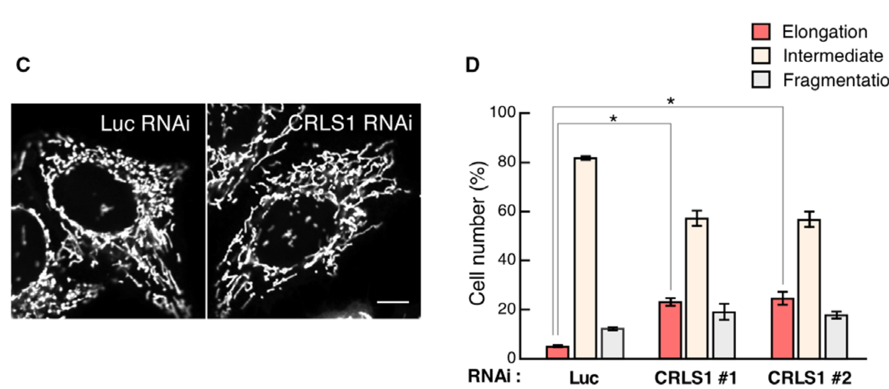

# CG4825课题相关文献

## 笔记摸板
---
##### Information
- Title:
- Author:
- Publish Date:
- Journal:
- Keywords: 
    > 
##### Notes
##### Conclusions
##### Summary
##### Citation
> 
---
## 脂类合成与代谢的调控

###  脂分子及功能信号

## 线粒体功能与代谢

### 线粒体脂类的合成转运及其功能

#### 2018
---
##### Information：
- Title: Inactivation of cardiolipin synthase triggers changes in mitochondrial morphology
- Author: Ayaka Matsumura, **Toshihiko Oka**
- Publish Date: available online 27 December 2017
- Journal: FEBS Letters
- Keywords: 
    > cardiolipin, CRLS1, mitochondrial morphology,phosphatidylglycerol
##### Notes:
- Mitochondria tubular networks dynamics: the balance between membrane fusion and fission regulated by GTPase.
    - fission: 
        - Drp1
            
            Drp1 is preferentially associated with membranes containing CL

    - fusion: 
        - mitofusin(*fzo-1* in nematode)   (outer membranes)
        - OPA1  (inner membranes):

            CL functions cooperatively with OPA1 in membrane fusion

- Cardiolipin (CL): anionic ([,ænaɪ'ɒnɪk]) phospholipid
    - function: complex formation of respiratory chains, maintenance of the cristae structures, and translocation of proteins into the mitochondria
    - Synthesis: 
        - phosphatidylglycerol (PG) + CDP-diacylglycerol -> CL  CL synthase
        - CDP-diacylglycerol + glycerol-3-phosphate -> PGP -[dephosphorylation]-> PG
##### Conclusions:
- PG accumulation but not CL reduction causes mitochondrial elongation in *C. elegans*
    - Knockdown of *crls-1* cause mitochondrial elongation in *C. elegans* body wall muscles

        
    note: 1) ectopic expression of mitochodnria-targeted fluorescent proteins were changed to  Mitotracker Red CMXRos (a membrane potential-dependent mitochondrial dye)

    - The mitochondrial elongation caused by *crls-1* KD is due to the inhibition of membrane division rather than the promotion of membrane fusion.

        
    
    - Knock down of four genes involved in CL synthesis does not lead to mitochondrial elongation

        

    - Double knockdown of *crls-1* and *psg-1* exhibited normal mitochondrial
    
        

- CL synthesis in *C. elegans*

    

- Knockdown of human CRLS1 leads to CL decrease and PG accumulation in HeLa cells

    

- Knockdown of CRLS1 causes the  mitonchondrial elongation but not PGS1 in Hela cells
    - mitoRFP
    
    
    
    - Mitotracker Red CMXros

    

    - Knockdown of PGS1

    

- Method:
    - preparation of mitochondria-enriched fraction from HeLa cell
        - HeLa cells were suspended in homogenization buffer () 
        - HeLa cells were homogenized by passing 30 times through a 27-gauge needle and then centrifuged at 900 × g for 5 min to remove nuclei and unbroken cells.
        - The supernatant was further centrifuged at  5000 x g for10min
        - the precipitates were applied as a mitochondria-enriched fraction for immunoblotting
    - Lipid extraction from mitochondria
        - Mitochondria-enriched fractions (160 μg protein) were precipitated by centrifugation (20600 × g 4°C) for 15 min
        - The precipitates were resuspended in 0.1 mL Milli-Q water and mixed with 0.9 mL chloroform/methanol (2:1, vol./vol.) and then vortexed for 15 min
        - add 0.2 mL 0.1 M HCl with 0.1 M KCl and vortexing further for 10min
        - cetrifugation (800 × g) for 2 min and collect the organic phase
        - dry the organic phase under nitrogen gas
        - dissolved in 0.5 mL methanol containing 10 mM ammonium acetate
##### Summary:
PG accumulation but not CL reduction causes mitochondrial elongation
##### Citation:
> Matsumura, A., Higuchi, J., Watanabe, Y., Kato, M., Aoki, K., Akabane, S., Endo, T., and Oka, T. (2018). Inactivation of cardiolipin synthase triggers changes in mitochondrial morphology. FEBS Lett 592, 209-218.
---
#### 2017
---
##### Information
- Title:Intramitochondrial phospholipid trafficking
- Author:**Takashi Tatsuta**, **Thomas Langer**
- Publish Date:Available online 16 August 2016
- Journal:Biochimica et Biophysica Acta-Molecular and Cell Biology of Lipids
- Keywords: 
    > Mitochondria, Cristae, Lipid transfer proteins,Membrane contact sites, Cardiolipin, Ups/PRELI
##### Notes
- Mitochondria evolved from endosymbiotic α-proteobacterial ancestors
    Ref: [1]

- Mitochondria function: 
    - ATP generation
    - metabolic processes
    - cellular signalling

- Mitochondria structure: contain low levels of sterols or sphigolipids
    - the mitochondrial outer membrane (OM)
    - the mitochondrial inner membrane (IM): high levels of cardiolipin (CL)

- CL
    - a diphosphatidylglycerol lipid carrying four acyl chains
    - cone-shpaed, non-bilayer lipid which harbours only samll head group

- CL and PE content in mitochondria 
    
    
    - CL and PE repesent up to 50% of the phospholipids in the IM and are more abundant in the membrane than any other cellular memebrane
    - The CL is inreiched in the IM whereas the content of CL in OM is lower than in the IM.

- The CL biogenesis and remodeling: enzymatic cascade
    
    

    - Ups1-Mdm35 in yeast (PRELID1-TRIAP1 in mammalian cells)
    - Ups1/Mdm35 complexes shuttle PA across the IMS
    - CL remodeling: convert newly synthesized CL into more symmetric moledules with poly-unsaturated acyl chains of defined length

- The function of CL in mitochondria

    

    - CL provides a signalling platform in the OM in response to cellular stress and mitochondrial damage and therefore has to relocate to initiate these events
    - In non-stressed cells, cytochrome c binds to CL molecules in the outer leaflet of the IM, facilitating electron channelling between complex III and complex IV. However, if mitochondrial function is impaired, CL peroxidation mainly mediated by the peroxidase activity of cytochrome c triggers the release of pro-apoptotic factors including cytochrome c from the IM [41]. 
    - Externalization of CL induced by mitochondrial stress also promotes elimination of damaged mitochondria by autophagy [43]. 
    - The autophagy initiator LC3 was found to bind to the CL at the surface of mitochondria and to promote engulfment of damaged mitochondria by autophagosome.
    - NDPK-D/NM23-H4 and MtCK, have been linked to CL externalization

- Mitochondria PE synthesis

    
    - PE can be generated from PS by the PS decarboxylase PSD (Psd1 in yeast)(PSD: IM protein exposing catalytic domains to the IMS)
    - Kennedy pathway allowing the formation of PE through conjugation of phosphoethanolamine to DAG from CDP-ethanolamine 
    - PS is exclusively synthesized in the ER by the PS synthase (PSS, Cho1 in yeast)
    - Ups2-Mdm35 in yeast or SLMO2-TRIAP1 in mammalian cells, shuttle PS across the IMS allowing its decarboxylation by Psd1 in the IM
    -  Psd1 can decarboxylate PS in the OM
    -  PS derived PE : independent of lipid-transfer by Ups2-Mdm35 but requires structural organization of the IM by MICOS complexes
    -  mitochondrial PE can serve as a precursor lipid for PC that is synthesized in the ER 
    -  PS transport is stimulated by the presence of CL in acceptor liposomes[58]

- The mitochondrial inner membrane and cristae organizing system **MICOS** 
    - Mic60, an integral IM protein carrying a large IMS-exposed domain. The IMS domain of Mic60 binds a number of OM proteins, including subunits of protein translocase of the outer membrane (TOM) and the sorting and assembly machinery (SAM/TOB)
    -  Ups2-Mdm35 transfers PS to the IM and ensures its decarboxylation to PE by Psd1, whereas Psd1 can form PE from PS in the OM independent of PS transfer by Ups2-Mdm35. The trans activity of Psd1 at the OM requires membrane organization by MICOS, which appears to ensure a close membrane apposition of IM and OM. 

- PC and PI are imported from the ER into mitochondria

    

    - the mechanisms of transport remains enigmatic

- Mechanism of phospholipid transfer by Ups/PRELI-Mdm35/TRIAP1 complexes

    

    - the loss of Ups1 results a significant reduction of CL
    - the loss of Ups2 impairs the accumulation of PE in mitochondria
    - Mammalian cells harbour four Ups1-like proteins termed PRELID1, PRELID2, SLMO1 and SLMO2 (Ups/PRELI family)
    - *Drosophila melanogaster* homologe *Slmo1* and *Slmo2* 
    - Ups1/Mdm35 complexes shuttle PA across the IMS
    - PRELID1 is the homologue of Ups1 in mammalian cells; TRIAP1, homologous to Mdm35
    -  Ups1-Mdm35 and PRELID1-TRIAP1 complexes shuttle PA across the IMS for CL synthesis in the IM, preserving mitochondrial functions and protecting cells against apoptosis
    - Ups1-Mdm35 or PRELID1-TRIAP1 is inhibited by CL, whereas PS transfer by Ups2-Mdm35 or SLMO2-TRIAP1 is enhanced in the presence of CL [17,58]. 
    -  the high affinity binding of Ups/PRELI proteins to the IM may not only limit backward transport, but also induces their degradation by IM proteases

- the lipid composition and structural organization of mitochondrial membranes
    - the enzymatic activity of various membrane associated proteins depends on CL, which is required for GTP hydrolysis of dynamin-like GTPases such as OPA1/Mgm1 and DRP1
    - The non-bilayer lipids CL and PE have overlapping functions in mitochondrial fusion and are required for mitochondrial tubulation in yeast
    - Loss of the PA transfer protein Ups1 impairs the processing of the dynamin Mgm1 by the rhomboid protease Pcp1 and causes mitochondrial fragmentation[72].
    - CL deficiencies in the absence of Ups1 compromise the local membrane environment that ensures efficient processing/biogenesis of Mgm1. 

##### Conclusions
##### Summary
Review: Intromitochondiral phospholipid trafficking
##### Citation
> Tatsuta, T., and Langer, T. (2017). Intramitochondrial phospholipid trafficking. Biochimica Et Biophysica Acta-Molecular and Cell Biology of Lipids 1862, 81-89.

---
#### 2016
---
##### Information
- Title:Mitochondrial phospholipids: role in mitochondrial function
- Author:Edgard M. Mejia, Grant M. Hatch
- Publish Date: online 28 January 2015
- Journal:J Bioenerg Biomembr 
- Keywords: 
    > Phospholipid, Mitochondria, Cardiolipin,Phosphatidylcholine,Phosphatidylethanolamine, Metabolism, Phosphatidylinositol,Phosphatidylserine, Phosphatidic acid, phosphatidylglycerol
##### Notes
- The mitochondria membrane lipid 
    - the outer mitochondrial membrane (OMM):
        - major: PC (~54%), PE (~29%), PI (14%)  (Daum and Vance 1997)
        - other: PS, PG, CL, PA etc
    - the inner mitochondrial membrane (IMM): in-foldings (cristae)
        - function: the housing of the proteins that make up electron tranport chain (ETC)
        - Lipid: PC and PE (75 %), CL (15-20%) (Daum and Vance 1997)
    

- PC 
    - imported into the mitochondria from other cellular sites
    - biosynthesis site : endoplasmic reticulum (ER):
        - Kennedy pathway: 
            1. dietary in-take choline ->p-choline CK
            2. p-choline + CTP -> CDP-choline CTP:phosphocholine cytidylyltransferase
            3.  CDP-choline + DAG -> PC
        - methylation of PE: PE -> PC  PEMT (phosphatidylethanolamine N-methyltransferase) (PEMT1 localised to ER; PEMT2 in MAM) (Vance 2013, Horvath and Daum 2013) (In mammalian: hepatocytes)
        PS: Increase PC synthesis by PEMT2 increase membrane fluidity and release of cytochrome c into cytoso resulting caspase induced apoptosis. 

- contact sites between MAM and mitochondria
    - ER-mitochondria encounter structures (ERMES) (Kornmann 2009,2013)

- the *de novo* synthesis of CL

    CL is remodelled by tafazzin, transacylase enzyme which transfers acyl groups from PC or PE to monolysocardiolipin (MLCL) to produce matrue CL (Hatch 2004)

- PE
    - a glycrol-3-phosphate backbone that contains a hydrophilic ethanolamine head group attached at the sn-3 position
    - the small size of the head group, conical shape
    - the synthesis of PE:
        - Kenney pathway (Kennedy 1956)
            1. EK: dietary ethanolamine -> p-ethanolamine
            2. CTP:phosphoethanolamine cytidyltransferase
                 phosphoethanolamine -> CDP-ehanolamine
            3. DAG + CDP-ethanolamine -> PE
        - PSD pathway
        - LPEAT: lyso-PE -> PE
        - PSS2: PS -> PE

    - structure: hexagonal phases
    - 
    - PE is crucial component necessary for the miantenance of mitochondrial morphology (Steenergen 2005)
        1. decrease mtPE via PSD results in aberrant mitochondrial morphology in CHO cells (Tasseva, 2013)
        2.  combination with loss of CL and PE is lethal in yeast (Gohil 2005)
        3.  CL and PE compensatory role in mitochondria (Joshi 2012)
        4.  The combination of decreased CL and PE synthesis in crd1Δ/psd1Δ conditional double mutants resulted in the complete blockage of mitochondrial fusion. 
    
    - PE has been shown to play a vital role in oxidative phosphorylation, a process that is required for mitochondrial ATP production
        1.  In CHO cells where PSD activity was silenced, decrease in mtPE not only adversely affected mitochondrial morphology, but resulted in a decrease in respiratory capacity and ATP production (Tasseva et al.2013)

- PS
    - has a molecular structure that is composed of a DAG backbone containing a phosphate group at the sn-3 position. The phosphate group is esterified to L-serine (van Meer et al. 2008). 
    - PS synthesis takes place in the MAM via calcium-dependent base-exchange reactions that remove either choline or ethanolamine from PC or PE, respectively,and replace the polar head group with L-serine (Vance and Tasseva 2013).  PSS1 and PSS2. And In prokaryotes and S. cerevisiae, only one PSS enzyme exists which uses CDP-DAG and L-serine to create PS (Vance and Tasseva 2013).
- PG
    most PG produced in mitochondria is quickly metabolized to form nascent CL. 

- PA  1-2% in mitochondrial membrane
    - PA sythesis:
        1. GPAT: G3P -> LPA  GPAT1 and GPAt2 in mitochondria
           AGPAT: LPA -> PA   ER or mito
        2. DAG -> PA
    - PA is required for the sysnthesis of glycerophospholipids and triacylglycerols (Athenstaedt 1999)

- CL
    - predominantly found in mitochondria
    - dimeric molecular structure: (cheng and Hatch 1995)
        - three glycerol groups
        - two phosphate moieties
        - four acyl chains
    - non-bilayer forming phospholipid, conical shape ,favours hexagonal phase formation
    - syntheisis
        - in the matrix side of the IMM
        - cytidine-5′-diphosphate-1,2-diacylglycerol pathway
        - remodeling process:incorporates specific acyl groups onto CL
            1. CL is hydrolysed to monolysocardiolipin (MLCL) by PLA~2~ 
            2. MLCL can be remodeled to contain specific acyl chains va tafazzin (Xu 2006),monolysocardiolipin acyltransferase-1(MLCL AT-1) (Taylor,2009) and acyl-CoA:lysocardiolipinacyltransferase-1 (ALCAT-1) (Cao,2004)
            3. PC supply the acyl to CL
    - *TAZ* gene chromosome Xq28: Barth syndrome (BTHS)
        - lymphoblasts of BTHS patients exhibited a collapsed intracristae space.
        - diminished CL levels in this BTHS model not only resulted in altered supercomplex formation and decreased mitochondrial function, but also an increase in reactive oxygen species (ROS) production
    - the interaction of CL and ETC complexes. 
    - CL is also reported to play an important role in mitochondrial-mediated apoptosis. 
    - failure to produce CL biosynthesis precursors such as PG in yeast results in lack of mitochondrial function. (Ostrander et al. 2001) demonstrated that this is caused by a failure to translate a number of mitochondrial encoded genes (COX 1, COX2, COX3 and COB) as well as one nuclear encoded gene (COX4) which are necessary for proper IMM function.
    - CL levels lead to a dysfunction of the TOM complex assembly and function, indicating that CL is required for the function of OMM transport proteins. 
    -  CL that involves its externalization from the IMM to the OMM as a signalling mechanism for mitophagy (Chu et al. 2013). 
        The autophagy protein microtubuleassociated-protein-1 light chain 3 (LC3) was shown to bind to CL and the resulting interaction then signaled for the removal of mitochondria via autophagosomes.
##### Conclusions
##### Summary
Review: mitochondrial phospholipids and its role in mitochondrial function
##### Citation
> Mejia, E.M., and Hatch, G.M. (2016). Mitochondrial phospholipids: role in mitochondrial function. J Bioenerg Biomembr 48, 99-112.
---
#### 2013 
---
##### Information：
- Title: Lipids of mitochondria
- Author: Susanne E. Horvath, Günther Daum
- Publish Date: Online 2 September 2013
- Journal: Progress in Lipid Research
- Keywords: 
    Lipid synthesis, Phospholipid, Mitochondria, Membranes, Lipid transport, Protein complex
##### Tips:

- Mitochondria lipids:
    - autonomously synthesized lipids: phosphatidylglycerol, cardiolipin, phosphatidylethanolamine, phosphatidic acid and CDP-diacylglycerol
    - imported: phosphatidylcholine, phosphatidylserine, phosphatidylinositol, sterols and sphingolipids

- Mitochondrion (mitochondria) complex sturcture:
    - the outer mitochondrial membran (OMM)
    - the IMS
    - the inner mitochondrial membran (IMM)
    - the matrix

- Mitochondria are partially autonomous organelles.
    - They harbor their own DNA, RNA and protein synthesizing machinery.
    - only 1% of their proteins are formed in mitochondrial matrix,others are coded by nuclear genes and imported into mitochondria.
    - Mitochondria are capable of synthesizing some lipids

- The lipid composition of mitochondria
    - phospholipid to protein and sterol to protein ratios are low compared to other subcellular fractions
    - PC and PE are the major phospholipids, acount for about 80% of total phospholipids
    - Mitochondria have high cardiolipin (CL) content in the range of 10-15%
    - Sterols and sphingolipids are only found at low amounts

- The lipid composition of subcellular fractions of rat liver

    
    - PS, sterols is pecidifc for PM and Golgi
    - sphigolipids is specific for lysosomes
    - Mitochondria have high cardiolipin (CL) content

- Asymmetric arrangement of lipids in mitochondrial membranes
    
>CL and PI are predominantly exposed to the matrix side of the IMM whereas PC and PE are nearly equally distributed between the two leaflets of the membrane.

- The biosynthesis of phosphatidylethanolamine
    
    - PSD1
        - The *PSD1* gene, 54kDa precursor protein, synthesized on cytosolic ribosomes and imported into mitochondria
        - Posttranslational processing of the Psd1 precursor
            - mitochondrial proteases MPP
            - Oct1
            - autocatalysis at the highly conseved **LGST** motif
        - the maturation of the enzyme:
            - beta subunit localized to the IMM
            - alpha subunit localized to the IMS
        - Major player in PE biosynthesis in yeast
    - Psd2
        - 19% sequence identity with Psd1
        - contain **GGST** motif
        - C2 doamin for protein kinase C family for Ca^2+^ binding

##### Citation:
> Horvath, S.E., and Daum, G. (2013). Lipids of mitochondria. Prog Lipid Res 52, 590-614.
---

### 线粒体相关蛋白及转运

#### 2016
---
##### Information：
- Label:
- Title：How lipids modulate mitochondrial protein import
- Author: Bottinger, L., Ellenrieder, L., and Becker, T.
- Publish Date: 2016
- Journal:  J Bioenerg Biomembr
- Keywords: 
    Mitochondria, Protein import, Cardiolipin, Phosphatidylethanolamine

##### Tips:
- The function of mitochondria:
    - ATP production
    - synthesis of lipids, amino acids and heme
    - signaling platform for apoptosis

- Mitochondrial functions rely on the presence of about 1000(yeast) or 1500(human) different proteins(Reinders et al.2006; Pagliarini et al.208).

- The protein import pathway in mitochondria

##### Citation:
> Bottinger, L., Ellenrieder, L., and Becker, T. (2016). How lipids modulate mitochondrial protein import. J Bioenerg Biomembr 48, 125-135.
---