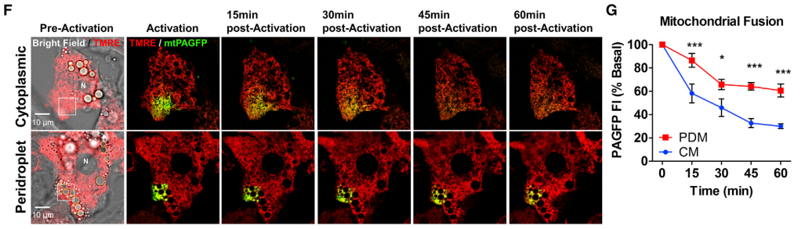

# 周六组会探讨文献

## 黄勋组
### 2018
#### 杨雷雷
---
##### Information：
- Title: Mitochondria Bound to Lipid Droplets Have Unique Bioenergetics, Composition, and Dynamics that Support Lipid Droplet Expansion
- Author: Ilan Y. Benador, **Orian S. Shirihai**
- Publish Date: April 3, 2018
- Journal: Cell Metabolism
- Keywords: 
    > brown adipose tissue, lipid droplet, mitochondria, mitochondrial dynamics,peridroplet mitochondria

##### Tips:

- Peridroplet mitochondria (PDM):
    - have increased pyruvte oxidation, electron transport, and ATP synthesis capacities

        
        

        > 2-fold increase in both ATP-synthesizing respiration (state III)and maximal respiratory capacity induced by uncoupling with FCCP (maximal) 
        
        > higher Cytochrome c oxidase (COX) activity 
    
    - reduced beta-oxidation capacity differnt to the LDs upon activation of BAT
    
        

    - support LD expansion by recuitmented of mitochondria to LDs increases ATP sytnthase-dependent tracylglyceride synthesis

        
        

        
        >G图：INS1, a pancreatic b cell line with low levels of endogenous Plin5 expression and lipogenic capacity 
    
        

    - maintain distinct protein composition due to low fusion-fission dynamics
        - PDM have reduced fusion compared to CM and decreased content exchange with the rest of the mitochondrial network

            

        - Reduced PDM motility

            

        - lower DRP1 staining on PDM compared to CM
            low leve of fusion

            
        
        - low inner membrane fusion 

            

- Isolation of peridroplet mitochondria by differental centrifugation
    - The schematic representation PDM and CM siolation
    
    - PDM and LDs are still associated after cell disruption.
    
    - isolation of PDM
    
    

- The peridroplet mitochondria (PDM) mediate the LD expansion depend on OXPHOS complexes and ATP syenthesis

    

##### Citation:
> Benador, I.Y., Veliova, M., Mahdaviani, K., Petcherski, A., Wikstrom, J.D., Assali, E.A., Acin-Perez, R., Shum, M., Oliveira, M.F., Cinti, S., et al. (2018). Mitochondria Bound to Lipid Droplets Have Unique Bioenergetics, Composition, and Dynamics that Support Lipid Droplet Expansion. Cell metabolism 27, 869-885.e866.
---
