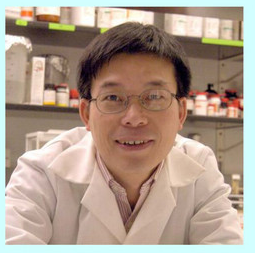
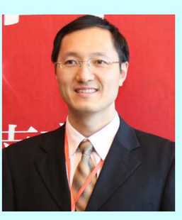

|作者姓名|照片|Education|单位|研究领域|
|------|-------|------|------|------|
|Tzumin Lee|||Group Leader, Janelia Research Camplus, Howard Hughes Medical Institute, USA|Fly brain development and evolution|
|Yi zhang||M.D. China Agricultural University 1987 & Ph.D Institute of Molecular Biophysics FSU & postdocotoral Danny Reinberg at HHMI|HHHMI Boston Children's Hospital|epigenetic regulation of gene expression as related to early development, stem cell reporgramming,differentiation etc|
|周斌||2002年 浙大 & 2006 协和医科大学 博士 & 哈弗医学院波士顿儿童医院 博士后|中科院上海生命科学研究院|细胞起源和名言|
