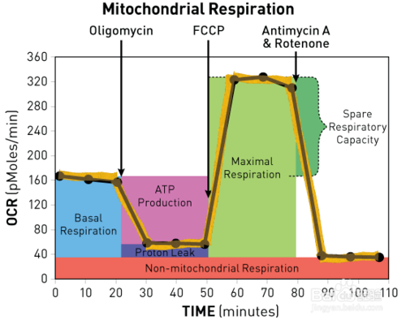
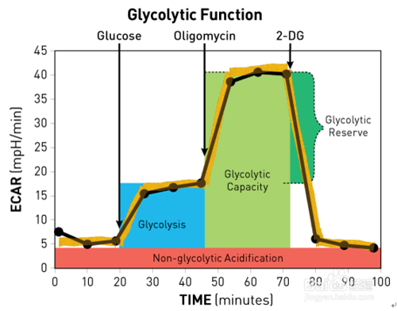

# 专业常用实验原理图解

## 1. 遗传分子生物学

## 2. 细胞生物学
---
- seahorse 图片结果的分析（OCR）（ECAR) 
    
    

    在加oligo之前显示的数值，代表的是细胞的基础耗氧量，包括线粒体氧化磷酸化及质子漏耗氧。即质子在线粒体膜通过呼吸链形成电势能后，一部分质子回流可以通过ATP合酶形成ATP，将势能转化为ATP中的能量。一部分通过线粒体膜但是只是发生氧化，势能转化为热量，但是没有用于合成ATP。oligo是ATP合酶抑制剂，加入此药后减少的耗氧代表的是机体用于ATP合成的耗氧量，间接显示此时细胞的ATP产量。FCCP是一种解偶联剂，作为一种质子载体使得大量质子回流，大量耗氧，但是这种质子回流不能形成ATP，FCCP后耗氧的增加，代表线粒体的最大耗氧能力，间接显示最大的呼吸能力，而其相对与基础值的高值代表其还具有的呼吸潜力。最后加入是抗霉素A和寡霉素，二者是呼吸链抑制剂，完全阻止线粒体耗氧。

    

    细胞的胞外产酸能力间接显示糖酵解能力

    基础值代笔的是细胞的非糖酵解产酸值，加入葡糖糖后代表的是此时细胞的糖酵解能力，而加入oligo后，氧化磷酸化被抑制，此时细胞完全靠糖酵解供氧，此时产酸增加，增加值代表细胞的还具有的糖酵解能力即潜力，总的数值代表细胞的最大糖酵解能力，最后加的是糖酵解抑制剂，此药之后的数值表明完全是由糖酵解之外的机理产酸所致的。
 
---

## 3. 生物化学

## 4. 生物信息学